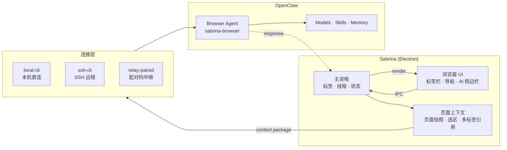
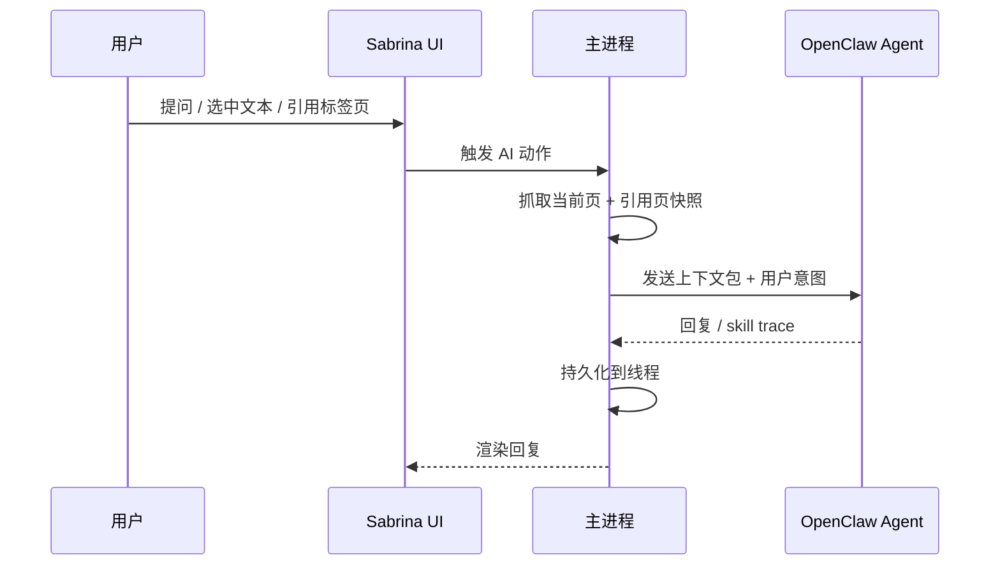

[English](./README_EN.md) | 中文

<p align="center">
  
</p>

<h1 align="center">Sabrina</h1>
<p align="center"><strong>OpenClaw 在浏览器里的原生工作台</strong></p>

<p align="center">
  <a href="https://github.com/jiaqi015/openclaw-ai-browser/stargazers"></a>
  
  
  
  <a href="https://github.com/jiaqi015/openclaw-ai-browser/releases"></a>
</p>

<p align="center">只有 IM 通道的 OpenClaw，是不完整的。<br/><strong>Sabrina 是它缺失的浏览器入口。</strong></p>

---

<!-- 截图占位：把 docs/screenshot.png 替换成真实截图后删除此注释 -->
<p align="center">
  
</p>

---

## 能做什么

> **Sabrina 的价值 = OpenClaw 的能力 × 浏览器的上下文。**
>
> 你在 OpenClaw 里积累的 skills、agent、模型策略、记忆约定——在浏览器里全部直接生效，不用重新配置，不用重新授权。

打开一个网页，侧边栏里 Sabrina 已经知道你在看什么。页面就是输入，OpenClaw 就是引擎。

**典型场景：**

- ⚡ **Skills 直通浏览器** — 你配好的 OpenClaw skill 在任何网页里直接触发。看竞品文档时一键提 issue、读合同时一键生成摘要、浏览代码库时直接调 review skill——页面内容自动作为输入，无需复制
- 🗂️ **GenTab × OpenClaw 生成力** — 选中多个参考标签页，交给 OpenClaw 一次性生成结构化结果页（对比表 / 列表 / 时间线）。多页研究变成一份可用的成果，而不只是一堆聊天记录
- 🤖 **Handoff 后台任务** — 在浏览器里触发，OpenClaw 在后台异步完成。不用守着等，继续浏览，任务跑完自动回来
- 🧵 **记忆跟着页面走** — 对话历史按页面和站点自动归档，复用你在 OpenClaw 里已有的 memory 约定。下次打开同一个页面，上下文还在
- 📎 **多标签作为上下文** — 同时引用多个打开的标签页，把浏览器里的信息密度直接喂给 OpenClaw，而不是逐个复制粘贴

---

## 与其他方案的区别

|  | **Sabrina** | Tabbit | Sider / Monica 等插件 | BrowserOS / Dia 等 AI 浏览器 | ChatGPT / Claude 网页版 |
|--|:-----------:|:------:|:--------------------:|:---------------------------:|:----------------------:|
| **上下文来源** | 自动读取当前页 + 选区 + 多标签引用 | @mention 引用标签页、分组、文件、截图 | 手动选中或复制 | 部分自动，多依赖截图 | 完全手动粘贴 |
| **多标签协作** | ✅ 一等公民 — 跨标签引用 + GenTab | ✅ @group + 后台 Agent | ⚠️ 单页为主 | ⚠️ 有限支持 | ❌ |
| **AI 能力来源** | 复用你已有的 OpenClaw 全栈 | 内置多模型（GPT / Gemini / Claude 等） | 自建封闭系统 | 自建封闭系统 | 平台绑定 |
| **线程连续性** | ✅ 按页面 / 站点关联，跨会话保持 | ❌ 无明确会话持久化 | ❌ 每次独立 | ⚠️ 部分支持 | ❌ 每次独立 |
| **后台自动化** | ✅ OpenClaw handoff 异步任务 | ✅ Background Agent | ❌ | ⚠️ 有限 | ❌ |
| **连接方式** | 本机 / SSH / Relay 配对码 | 云端 | 插件 | 内置 | 浏览器 |
| **开源** | ✅ MIT | ❌ 闭源 | ❌ | ❌ | ❌ |

> Sabrina 不重新造 AI，而是让你**已有的 OpenClaw** 在浏览器里原生工作。

---

## 快速开始

### 下载安装（推荐）

→ [Releases 页面](https://github.com/jiaqi015/openclaw-ai-browser/releases) 下载最新 `.dmg`

> ⚠️ 当前版本未签名，首次打开右键 → Open，或运行：`xattr -cr /Applications/Sabrina.app`

### 从源码运行

```bash
git clone https://github.com/jiaqi015/openclaw-ai-browser.git
cd openclaw-ai-browser
npm install
npm run dev
```

**前置条件：** macOS + Node.js 18+ + 本机或远端已安装 OpenClaw

### 连接 OpenClaw

1. 打开 Sabrina → `OpenClaw` 设置页
2. 选择连接方式：
   - **本机** — OpenClaw 在本机运行，直接连
   - **SSH 远程** — 填写 SSH 地址，远程执行
   - **Relay 配对** — 生成 6 位配对码，扫码连接远端 OpenClaw
3. 运行快速检查，连接成功即可使用

详见 [接入 OpenClaw 指南](docs/CONNECT_OPENCLAW.md)

---

## 核心功能

**🔍 页面上下文自动注入** — 打开侧边栏，Sabrina 已经知道你在看什么。

**🗂️ 多标签引用** — 同时引用多个标签页作为输入。比较文档、汇总资料，全部一起送进去。

**✨ GenTab** — 选中多个参考页，一键生成结构化结果页（表格 / 列表 / 时间线 / 卡片网格）。

**⚡ Skills 直达** — OpenClaw skill ecosystem 直接在浏览器里用，页面内容作为自然输入。

**🔄 模型实时切换** — 不出浏览器，直接在任务里换模型。

**🧵 线程记忆** — 对话历史按页面 / 站点自动归档，跨会话保持。

**🔌 三种连接模式** — 本机直连、SSH 远程、Relay 配对码，适配不同网络环境。

---

<details>
<summary>💡 为什么做 Sabrina</summary>

Sabrina 不是"又一个 AI 浏览器"。

它是 **OpenClaw 在浏览器场景里的原生工作台**：把 OpenClaw 已有的 agent、skills、memory、model policy 和 runtime session，带进用户每天停留时间最长、上下文最丰富的工作表面。

大多数 AI 产品要求用户先离开页面，再去聊天框重建上下文。Sabrina 反过来：

- 不让用户复制链接和选区去"喂给" AI
- 不让用户重新描述自己正在看的内容
- 不让浏览器工作在进入 AI 前先中断一次

**用户正在看的页面，本身就是最重要的输入。**

Sabrina 最大的优势不是重新做一套 AI 平台，而是复用 OpenClaw 已经成立的能力层：agent、auth、model policy、skill ecosystem、session 约定。**换了场景，能力还在。**

</details>

<details>
<summary>🏗️ 架构</summary>

三层结构：浏览器 UI → 主进程 → OpenClaw（通过可插拔 driver）



**请求链路**



</details>

---

## 文档

| 文档 | 内容 |
|------|------|
| [接入 OpenClaw](docs/CONNECT_OPENCLAW.md) | 三种连接方式的配置步骤 |
| [Turn Engine Design](docs/TURN_ENGINE_DESIGN.md) | turn 生命周期、执行规划、receipt normalization |
| [GenTab PRD](docs/GENTAB_PRD.md) | GenTab 完整产品需求、输入输出约束 |
| [Engineering System](docs/ENGINEERING_SYSTEM.md) | 架构边界与工程约定 |
| [Design Baseline](docs/DESIGN_BASELINE.md) | UI 调性、组件约束与扩展规则 |
| [System State](docs/SYSTEM_STATE.md) | 当前系统全貌、哪些是真的、下一步 |

---

## Contributing

欢迎 PR 和 Issue。请先读 [Engineering System](docs/ENGINEERING_SYSTEM.md) 了解架构边界，跑 `npm run acceptance` 确认没有回归。

如果你觉得 Sabrina 有用，**点个 ⭐ 是最好的支持。**

## License

[MIT](./LICENSE)
