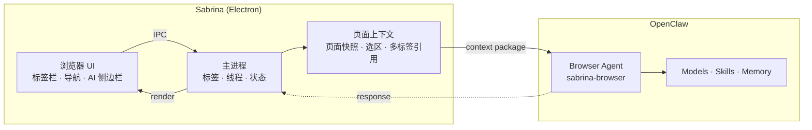
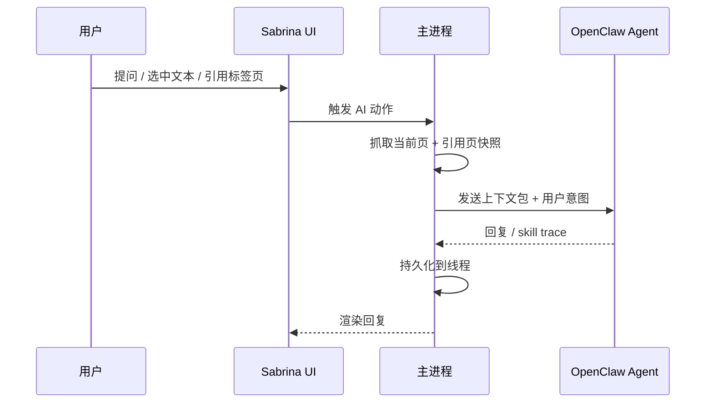

[English](./README_EN.md) | 中文

<p align="center">
  
</p>

<h1 align="center">Sabrina</h1>
<p align="center"><strong>OpenClaw 在浏览器里的原生工作台</strong></p>

<p align="center">
  <a href="https://github.com/jiaqi015/openclaw-ai-browser/stargazers"></a>
  
  
  
  <a href="https://github.com/jiaqi015/openclaw-ai-browser/releases"></a>
</p>

<p align="center">只有 IM 通道的 OpenClaw，是不完整的。<br/><strong>Sabrina 是它缺失的浏览器入口。</strong></p>

---

## 和其他方案的区别

|  | Sabrina | Tabbit | Sider / Monica 等插件 | BrowserOS / Dia 等 AI 浏览器 | ChatGPT / Claude 网页版 |
|--|:-------:|:------:|:--------------------:|:---------------------------:|:----------------------:|
| **上下文来源** | 自动读取当前页 + 选区 + 多标签引用 | @mention 引用标签页、分组、文件、截图 | 手动选中或复制 | 部分自动，多依赖截图 | 完全手动粘贴 |
| **多标签协作** | 一等公民 — 跨标签引用 + GenTab | 支持 — @group 引用 + 后台 Agent 跨标签操作 | 单页为主 | 有限支持 | 不支持 |
| **AI 能力来源** | 复用你已有的 OpenClaw 全栈 | 内置多模型（GPT / Gemini / Claude / DeepSeek 等），免费切换 | 自建封闭系统 | 自建封闭系统 | 平台绑定 |
| **线程连续性** | 按页面 / 站点自动关联，跨会话保持 | 无明确会话持久化 | 每次对话独立 | 部分支持 | 每次对话独立 |
| **模型切换** | 浏览器内实时切换，复用 OpenClaw 模型策略 | 支持，每个对话可切换 | 固定或有限选择 | 固定或有限选择 | 平台绑定 |
| **技能生态** | 复用 OpenClaw skill ecosystem | 自定义 Shortcut（no-code prompt 自动化） | 内置有限工具 | 内置有限工具 | 插件市场 |
| **后台自动化** | OpenClaw handoff 异步任务 | 内置 Background Agent，可自主完成多步任务 | 无 | 有限 | 无 |
| **浏览器离线** | 主链路完整，AI 优雅降级 | 完整浏览器（Chromium），AI 需联网 | 依赖宿主浏览器 | 完整浏览器 | 不可用 |
| **开源** | ✅ MIT | ❌ 闭源免费 | ❌ | ❌ | ❌ |

> **Sabrina 不重新造 AI，而是让你已有的 OpenClaw 在浏览器里原生工作。**

---

## 核心能力

**页面上下文自动注入** — 打开侧边栏，Sabrina 已经知道你在看什么。不需要复制，不需要描述，不需要粘贴链接。

**多标签引用** — 同时引用多个标签页作为输入。比较三个产品？分析多份文档？全部一起送进去。

**GenTab** — 选中多个引用页，一键生成结构化结果页面。从"阅读网页"变成"生产成果"。

**技能直达** — OpenClaw 的 skill ecosystem 直接在浏览器里用。页面标题、正文、选区都是更自然的 skill 输入。

**模型实时切换** — 不用出浏览器，直接在当前任务里换模型。

**线程记忆** — 对话历史按页面 / 站点自动关联。关掉再打开，上下文还在。

**OpenClaw 原生接入** — 复用本机已有的 agent、auth、model policy、session。不是再安装一套，而是把浏览器接进你已经在用的 OpenClaw。

---

## 用户接入

如果你是第一次使用 Sabrina，先看：

- [接入 OpenClaw 指南](docs/CONNECT_OPENCLAW.md)

最短路径：

1. 下载并安装 Sabrina。
2. 确认本机或远端 OpenClaw 已经可用。
3. 在 Sabrina 的 `OpenClaw` 设置页里选择：
   - `本机`
   - 或 `远程 -> 通过 SSH / 通过连接码`
4. 先做一次快速检查，再正式连接。

## 开发 Quickstart

```bash
npm install
npm run dev
```

前提：本机已安装并可运行 OpenClaw，本机 OpenClaw gateway 可用。

```bash
# 验收测试
npm run acceptance
```

---

## 为什么做 Sabrina

<details>
<summary>展开阅读</summary>

Sabrina 不是"又一个 AI 浏览器"。

它是 **OpenClaw 在浏览器场景里的原生工作台**：把 OpenClaw 已有的 agent、skills、memory、model policy 和 runtime session，带进电脑上最富上下文、最高频的工作表面之一。

浏览器是用户每天停留时间最长、上下文最丰富、最接近真实任务现场的地方。大多数 AI 产品都要求用户先离开页面，再去聊天框里重建上下文。Sabrina 反过来：

- 不让用户复制链接和选区去"喂给" AI
- 不让用户重新描述自己正在看的内容
- 不让浏览器工作在进入 AI 之前先中断一次

它默认认为：**用户正在看的页面，本身就是最重要的输入。**

Sabrina 最大的优势，不是重新做一套 AI 平台，而是复用 OpenClaw 已经成立的能力层：

- **Binding reuse** — 直接接入本机 OpenClaw 运行环境
- **Token / auth reuse** — 复用本地 device auth、gateway 鉴权
- **Model reuse** — 复用已有模型配置与策略
- **Skill reuse** — 已有 OpenClaw skills 在浏览器里继续工作
- **Memory conventions reuse** — 复用 session / workspace 约定

> **换了场景，能力还在。**

</details>

## Architecture

<details>
<summary>展开查看架构图与请求链路</summary>

三层结构：浏览器 UI、主进程、OpenClaw。



**Design Principles**

- **Browser-first** — 浏览器主链路在 OpenClaw 不可用时仍然成立
- **Tab / Thread / Session 分离** — 浏览器容器、用户任务历史、OpenClaw runtime context 是三件事
- **Main-process-owned runtime** — durable state 收敛到主进程
- **Text-first context pipeline** — 结构化页面快照，而不是让用户手工补上下文
- **Dedicated browser agent** — 通过独立 `sabrina-browser` agent 接入 OpenClaw

**Request Flow**



</details>

---

## Docs

- [Docs Guide](docs/DOCS_GUIDE.md) — 文档阅读顺序、不同角色先读什么、怎么建立当前真相
- [Engineering System](docs/ENGINEERING_SYSTEM.md)
- [Acceptance Matrix](docs/ACCEPTANCE_MATRIX.md)
- [Iteration Loop](docs/ITERATION_LOOP.md)
- [Browser/OpenClaw Architecture](docs/BROWSER_OPENCLAW_ARCHITECTURE.md)
- [Turn Engine Design](docs/TURN_ENGINE_DESIGN.md) — Sabrina turn lifecycle、execution planning、receipt normalization
- [System State](docs/SYSTEM_STATE.md) — 当前系统全貌、哪些是真的、哪些还没做、当前门禁与下一步
- [Next Phase Plan](docs/NEXT_PHASE_PLAN.md) — 下一阶段五条主线、目标、交付和验收
- [Claude Code Learnings](docs/CLAUDE_CODE_LEARNINGS.md) — 值得学的机制、代码策略，以及如何落回 Sabrina 定位
- [Design Baseline](docs/DESIGN_BASELINE.md) — UI 调性、线程系统、组件约束与扩展规则

## Contributing

欢迎 PR 和 Issue。请先读 [Engineering System](docs/ENGINEERING_SYSTEM.md) 了解架构边界，跑 `npm run acceptance` 确认没有回归。

## License

[MIT](./LICENSE)
