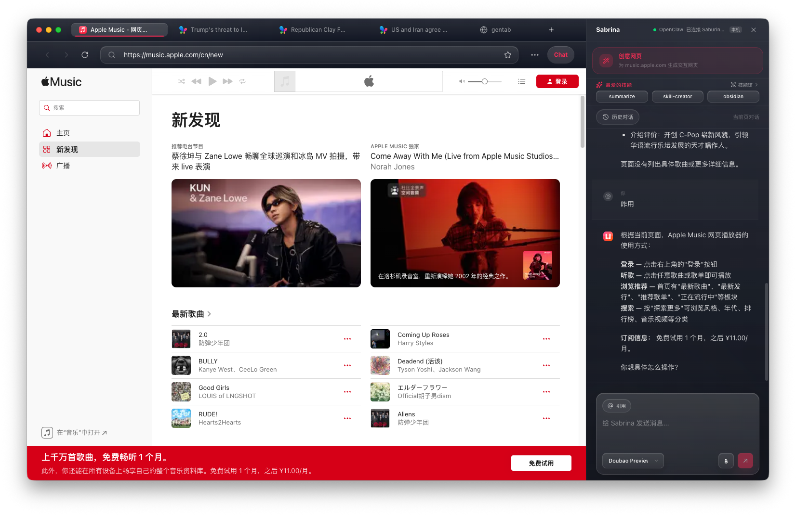
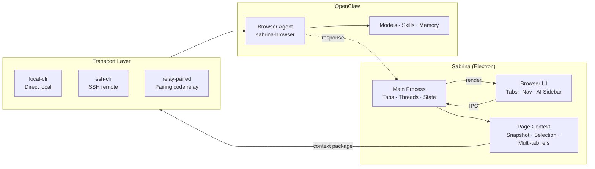
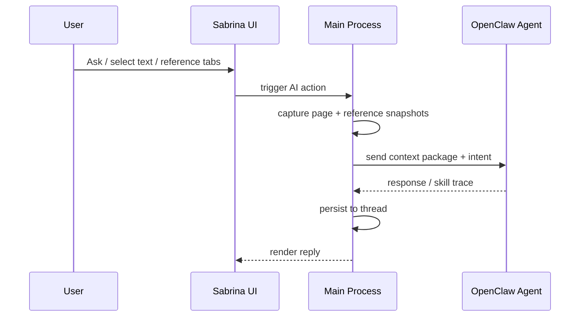

[中文](./README.md) | English

<p align="center">
  
</p>

<h1 align="center">Sabrina</h1>
<p align="center"><strong>Unified memory · Shared skills · 90% of your daily computer use, covered</strong></p>

<p align="center">
  <a href="https://github.com/jiaqi015/openclaw-ai-browser/stargazers"></a>
  
  
  
  <a href="https://github.com/jiaqi015/openclaw-ai-browser/releases"></a>
</p>

<p align="center">OpenClaw through IM alone is incomplete.<br/><strong>Sabrina is the browser presence it's been missing.</strong></p>
<p align="center">OpenClaw handles IM. Sabrina handles the browser.<br/>Same skills. Same memory. One AI system.</p>

---

<!-- Screenshot placeholder: replace docs/screenshot.png with a real screenshot, then delete this comment -->
<p align="center">
  
</p>

---

## What It Does

OpenClaw users spend a huge chunk of their day in the browser — researching, reading docs, checking competitors, organizing information. In all of those moments, OpenClaw's IM channel can't help.

Sabrina closes that gap: **every page in your browser becomes a direct entry point into the full capabilities you've already built in OpenClaw.** Skills don't need reconfiguring. Memory doesn't break. Your model policies keep working.

Open any webpage — the sidebar already knows what you're looking at. The page is the input. OpenClaw is the engine.

**Common use cases:**

- ⚡ **Skills straight to the browser** — Trigger any OpenClaw skill directly on any webpage. Reading competitor docs? File an issue in one click. Reviewing a contract? Generate a summary. Browsing a codebase? Run your review skill — page content becomes the input automatically, no copying needed
- 🗂️ **GenTab × OpenClaw generation** — Select multiple reference tabs, let OpenClaw generate a structured result page (comparison table / list / timeline). Turn multi-tab research into a usable artifact, not just a chat log
- 🤖 **Handoff to background tasks** — Trigger from the browser, OpenClaw completes it asynchronously. Keep browsing — results come back when it's done
- 🧵 **Memory follows the page** — Conversation history auto-archives by page and site, reusing your existing OpenClaw memory conventions. Next time you open the same page, context is still there
- 📎 **Multiple tabs as context** — Reference several open tabs at once and feed the full information density of your browser session directly to OpenClaw — not one paste at a time

---

## How It Compares

|  | **Sabrina** | Tabbit | Sider / Monica / Extensions | BrowserOS / Dia / AI Browsers | ChatGPT / Claude Web |
|--|:-----------:|:------:|:---------------------------:|:-----------------------------:|:--------------------:|
| **Context source** | Auto-reads current page + selection + multi-tab refs | @mention tabs, groups, files, screenshots | Manual select or copy | Partial auto, often screenshot-based | Fully manual paste |
| **Multi-tab collaboration** | ✅ First-class — cross-tab refs + GenTab | ✅ @group refs + background agent | ⚠️ Single page only | ⚠️ Limited | ❌ |
| **AI capability source** | Reuses your existing OpenClaw stack | Built-in multi-model (GPT / Gemini / Claude etc.) | Self-contained closed system | Self-contained closed system | Platform-locked |
| **Thread continuity** | ✅ Auto-associated by page/site, persists across sessions | ❌ No session persistence | ❌ Isolated per conversation | ⚠️ Partial | ❌ Isolated |
| **Background automation** | ✅ OpenClaw async handoff | ✅ Background Agent | ❌ | ⚠️ Limited | ❌ |
| **Connection** | Local / SSH / Relay pairing code | Cloud | Extension | Built-in | Browser |
| **Open source** | ✅ MIT | ❌ Closed freeware | ❌ | ❌ | ❌ |

> Sabrina doesn't reinvent AI — it lets your **existing OpenClaw** work natively in the browser.

---

## Quick Start

### Download & Install (Recommended)

→ [Releases page](https://github.com/jiaqi015/openclaw-ai-browser/releases) — download the latest `.dmg`

> ⚠️ Current builds are unsigned. On first open: right-click → Open, or run: `xattr -cr /Applications/Sabrina.app`

### Build from Source

```bash
git clone https://github.com/jiaqi015/openclaw-ai-browser.git
cd openclaw-ai-browser
npm install
npm run dev
```

**Prerequisites:** macOS + Node.js 18+ + OpenClaw installed locally or remotely

### Connect OpenClaw

1. Open Sabrina → `OpenClaw` settings
2. Choose connection mode:
   - **Local** — OpenClaw running on this machine, connect directly
   - **SSH remote** — enter SSH address, executes remotely
   - **Relay pairing** — generate a 6-character code, connect remote OpenClaw
3. Run a quick health check — you're ready

See [Connecting to OpenClaw](docs/CONNECT_OPENCLAW.md) for details.

---

## Features

**🔍 Zero-friction page context** — Open the sidebar and Sabrina already knows what you're looking at.

**🗂️ Multi-tab references** — Reference multiple open tabs simultaneously. Compare docs, aggregate research — send them all at once.

**✨ GenTab** — Select reference tabs, generate a structured result page (table / list / timeline / card grid) in one click.

**⚡ Skills in full context** — OpenClaw's skill ecosystem works directly in the browser, with page content as natural input.

**🔄 Real-time model switching** — Switch models mid-task without leaving the browser.

**🧵 Thread memory** — Conversation history auto-archives by page and site. Close and reopen — context is still there.

**🔌 Three connection modes** — Local CLI, SSH remote, or Relay pairing code — works in any network environment.

---

<details>
<summary>💡 Why Sabrina</summary>

Sabrina is not "yet another AI browser."

It is **OpenClaw's native workspace for the browser** — bringing OpenClaw's existing agents, skills, memory, model policies, and runtime sessions into the richest, highest-frequency work surface on your computer.

Most AI tools ask you to leave the page first, then rebuild context in a chat box. Sabrina inverts this:

- No copying links and selections to "feed" the AI
- No re-describing what you're already looking at
- No interrupting browser work before engaging AI

**The page you're looking at is the most important input.**

Sabrina's advantage isn't rebuilding an AI platform — it's reusing OpenClaw's established capability layer: agent, auth, model policy, skill ecosystem, session conventions. **Different surface. Same capabilities.**

</details>

<details>
<summary>🏗️ Architecture</summary>

Three layers: Browser UI → Main Process → OpenClaw (via pluggable driver)



**Request Flow**



</details>

---

## Docs

| Doc | Contents |
|-----|----------|
| [Connecting OpenClaw](docs/CONNECT_OPENCLAW.md) | Setup steps for all three connection modes |
| [Turn Engine Design](docs/TURN_ENGINE_DESIGN.md) | Turn lifecycle, execution planning, receipt normalization |
| [GenTab PRD](docs/GENTAB_PRD.md) | Full product spec, input/output constraints |
| [Engineering System](docs/ENGINEERING_SYSTEM.md) | Architecture boundaries and conventions |
| [Design Baseline](docs/DESIGN_BASELINE.md) | UI tone, component constraints, extension rules |
| [System State](docs/SYSTEM_STATE.md) | Current system overview, what's real, what's next |

---

## Contributing

PRs and Issues welcome. Read [Engineering System](docs/ENGINEERING_SYSTEM.md) first to understand architecture boundaries, then run `npm run acceptance` to make sure nothing regressed.

If Sabrina is useful to you, **a ⭐ is the best way to support it.**

## License

[MIT](./LICENSE)
