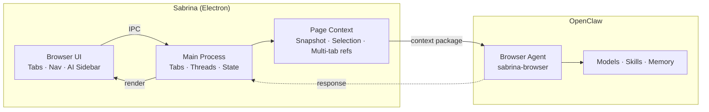
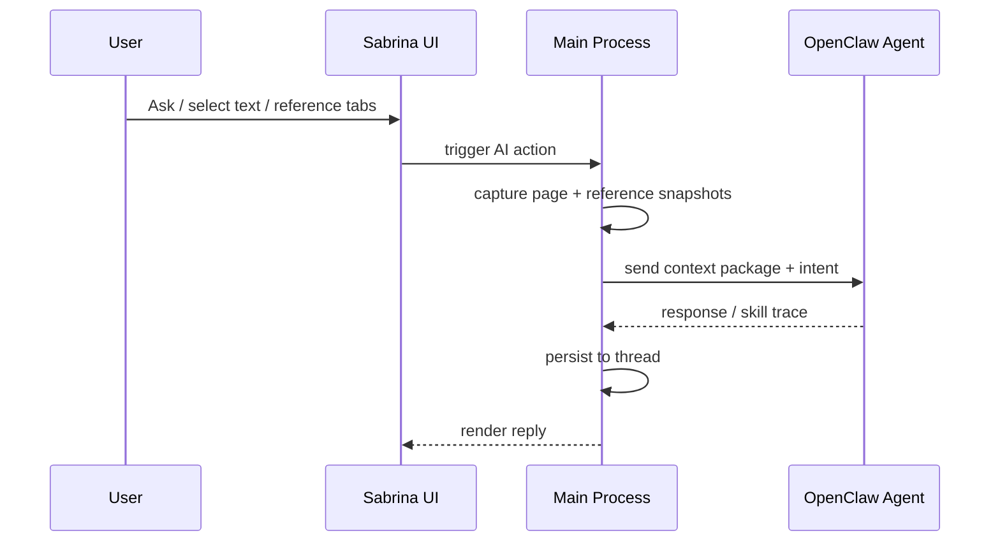

[中文](./README.md) | English

<p align="center">
  <picture>
    <source media="(prefers-color-scheme: dark)" srcset="docs/icon.svg" />
    <source media="(prefers-color-scheme: light)" srcset="docs/icon.svg" />
    
  </picture>
</p>

<h1 align="center">Sabrina</h1>
<p align="center"><strong>The native browser workspace for OpenClaw</strong></p>

<p align="center">
  <a href="https://github.com/jiaqi015/openclaw-ai-browser/stargazers"></a>
  
  
  
  <a href="https://github.com/jiaqi015/openclaw-ai-browser/releases"></a>
</p>

<p align="center">OpenClaw through IM alone is incomplete.<br/><strong>Sabrina is the browser presence it's been missing.</strong></p>

---

## How Sabrina Compares

|  | Sabrina | Tabbit | Sider / Monica / Extensions | BrowserOS / Dia / AI Browsers | ChatGPT / Claude Web |
|--|:-------:|:------:|:---------------------------:|:-----------------------------:|:--------------------:|
| **Context source** | Auto-reads current page + selection + multi-tab refs | @mention tabs, groups, files, screenshots | Manual select or copy | Partial auto, often screenshot-based | Fully manual paste |
| **Multi-tab collaboration** | First-class — cross-tab references + GenTab | Supported — @group refs + background agent across tabs | Single page only | Limited support | Not supported |
| **AI capability source** | Reuses your existing OpenClaw stack | Built-in multi-model (GPT / Gemini / Claude / DeepSeek), free switching | Self-contained closed system | Self-contained closed system | Platform-locked |
| **Thread continuity** | Auto-associated by page / site, persists across sessions | No explicit session persistence | Each conversation isolated | Partial support | Each conversation isolated |
| **Model switching** | Real-time in-browser, reuses OpenClaw model policies | Supported, switchable per conversation | Fixed or limited choices | Fixed or limited choices | Platform-locked |
| **Skill ecosystem** | Reuses OpenClaw skill ecosystem | Custom Shortcuts (no-code prompt automations) | Limited built-in tools | Limited built-in tools | Plugin marketplace |
| **Background automation** | OpenClaw async handoff | Built-in Background Agent for autonomous multi-step tasks | None | Limited | None |
| **Offline browser** | Full browser, AI degrades gracefully | Full browser (Chromium), AI requires internet | Depends on host browser | Full browser | Unavailable |
| **Open source** | ✅ MIT | ❌ Closed freeware | ❌ | ❌ | ❌ |

> **Sabrina doesn't reinvent AI — it lets your existing OpenClaw work natively in the browser.**

---

## What Sabrina Does

**Zero-friction page context** — Open the sidebar and Sabrina already knows what you're looking at. No copying. No describing. No pasting links.

**Multi-tab references** — Reference multiple open tabs as inputs simultaneously. Comparing three products? Analyzing multiple docs? Send them all in at once.

**GenTab** — Select multiple reference tabs, generate a structured result page in one click. Go from "reading the web" to "producing output."

**Skills in full context** — OpenClaw's skill ecosystem works directly in the browser. Page title, body text, and selections are all richer, more natural skill inputs than a plain chat box.

**Real-time model switching** — Switch models mid-task without leaving the browser.

**Thread memory** — Conversation history auto-associates with pages and sites. Close and reopen — the context is still there.

**Native OpenClaw binding** — Reuses your local agents, auth, model policies, and sessions. Not another install. Just connect your browser to the OpenClaw you already have.

---

## Quickstart

```bash
npm install
npm run dev
```

Prerequisites: OpenClaw installed and running locally, local OpenClaw gateway available.

```bash
# Run acceptance tests
npm run acceptance
```

---

## Why Sabrina

<details>
<summary>Read more</summary>

Sabrina is not "yet another AI browser."

It is **OpenClaw's native workspace for the browser**: bringing OpenClaw's existing agents, skills, memory, model policies, and runtime sessions into one of the most context-rich, highest-frequency work surfaces on your computer.

The browser is where users spend the most time — the richest context, closest to real tasks. Most AI products require users to leave the page first, then rebuild context in a chat box. Sabrina inverts this:

- No copying links and selections to "feed" the AI
- No re-describing what you're currently looking at
- No interrupting your browser workflow before engaging AI

It assumes by default: **The page you're looking at is the most important input.**

Sabrina's greatest advantage isn't rebuilding an AI platform from scratch — it's reusing OpenClaw's established capability layer:

- **Binding reuse** — directly connects to your local OpenClaw runtime
- **Token / auth reuse** — reuses local device auth and gateway authentication
- **Model reuse** — reuses existing model configurations and policies
- **Skill reuse** — existing OpenClaw skills work in the browser context
- **Memory conventions reuse** — reuses session / workspace conventions

> **Different surface. Same capabilities.**

</details>

## Architecture

<details>
<summary>View architecture diagram and request flow</summary>

Three layers: Browser UI, Main Process, OpenClaw.



**Design Principles**

- **Browser-first** — Core browsing remains usable when OpenClaw is unavailable
- **Tab / Thread / Session separation** — Browser containers, user task history, and OpenClaw runtime context are three separate things
- **Main-process-owned runtime** — Durable state converges to the main process
- **Text-first context pipeline** — Structured page snapshots, not manual context pasting
- **Dedicated browser agent** — Connects via independent `sabrina-browser` agent

**Request Flow**



</details>

---

## Docs

- [Engineering System](docs/ENGINEERING_SYSTEM.md)
- [Acceptance Matrix](docs/ACCEPTANCE_MATRIX.md)
- [Iteration Loop](docs/ITERATION_LOOP.md)
- [Browser/OpenClaw Architecture](docs/BROWSER_OPENCLAW_ARCHITECTURE.md)
- [Design Baseline](docs/DESIGN_BASELINE.md) — UI tone, thread system, component constraints and extension rules

## Contributing

PRs and issues welcome. Read [Engineering System](docs/ENGINEERING_SYSTEM.md) first to understand architectural boundaries, then run `npm run acceptance` to confirm no regressions.

## License

[MIT](./LICENSE)
