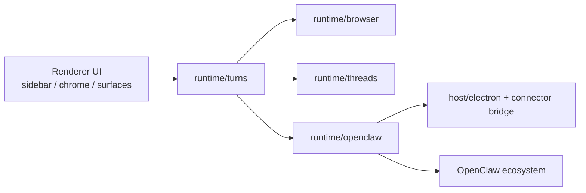

# Sabrina System State

这份文档不是新的设计稿，也不是未来路线图。

它只做一件事：

**把 Sabrina 当前到底是什么、已经做到哪一步、哪些是真的、哪些还没做，集中整理成一个稳定入口。**

配套阅读：

- [Docs Guide](./DOCS_GUIDE.md)
- [Next Phase Plan](./NEXT_PHASE_PLAN.md)
- [What Sabrina Should Learn From Claude Code](./CLAUDE_CODE_LEARNINGS.md)

---

## 一句话

**Sabrina 已经不是“浏览器里接一个 AI 侧栏”。**

它当前的系统定义是：

- **Browser owns truth**：浏览器负责真实页面、选区、引用页、来源和执行事实
- **Threads own continuity**：线程负责用户可见连续性
- **Turns own planning**：turn 负责把一次意图变成正式执行单元
- **OpenClaw owns execution**：OpenClaw 负责模型、skill、task、trace、gateway 和生态

---

## 产品定义

Sabrina 的价值不是“把 OpenClaw 放进浏览器 UI”。

真正的产品定义是：

1. 浏览器是最高上下文密度的工作现场
2. Sabrina 先把这个现场打包成自己的 runtime object
3. OpenClaw 再对这个对象执行

所以 Sabrina 不是：

- prompt glue
- 一个 AI sidebar
- 浏览器里的第二套 OpenClaw 平台

它是：

**OpenClaw 在浏览器里的原生工作系统。**

---

## 当前系统图

### `runtime/browser`

负责：

- 页面提取
- 选区
- 多标签引用
- Browser Context Package
- 页面级 execution facts
- GenTab 的浏览器侧输入

### `runtime/threads`

负责：

- thread identity
- tab-thread binding
- durable thread state
- 用户可见连续性
- turn append 入口

### `runtime/turns`

负责：

- TurnIntent intake
- ExecutionPlan planning
- receipt normalization
- turn journal
- 把 ask / skill / handoff / gentab 收成统一 turn

### `runtime/openclaw`

负责：

- binding / connection
- model policy
- skill catalog
- skill execution
- task handoff
- doctor / memory bridge / turn journal query
- OpenClaw 生态复用

### `host/electron`

负责：

- main/preload/ipc
- connector bridge
- host smoke 边界

---

## 当前已经成立的核心 Contract

### 1. Browser Context Package

它已经不是“内容快照数组”了，而是 Sabrina 的正式浏览器工作包。

现在它至少包含：

- primary page
- referenced pages
- selection
- provenance
- requested/missing references
- extraction stats
- execution facts

execution facts 已经包括：

- source kind
- trust/auth boundary
- reachability
- reproducibility
- lossiness
- browser-only / filesystem / browser-session 等执行约束

这意味着 Sabrina 已经不只是“把网页文本塞进 prompt”。

### 2. ExecutionPlan

Turn planner 现在已经会产出正式 plan，而不是 feature helper 临时拼参数。

当前 plan 会携带：

- turn identity
- strategy
- browser context summary
- skill/input policy
- capability provenance
- honesty mode
- required evidence
- execution contract

### 3. TurnReceipt + TurnJournal

Sabrina 现在已经把：

- thread visible history
- execution receipt
- Sabrina-side turn evidence

分成了不同层，而不是全部混在 thread messages 里。

这意味着：

- 用户看到的是 thread continuity
- Sabrina 自己保留的是 turn evidence
- OpenClaw 返回的是 trace / execution proof

### 4. Browser Capability Contract

skill 的浏览器兼容性现在已经不是平铺字符串字段了。

当前系统里已经有：

- `declaredBrowserCapability`
- final resolved `browserCapability`
- provenance source
- Sabrina overlay vs declared truth 的区分

这让“显式声明”和“本地兜底”不再混成一层。

### 5. Remote Session Contract

远程 transport 的事实现在已经是正式 contract，而不是散落字段。

连接状态里已经会带：

- transport
- driver
- profile
- state dir
- ssh target / relay url
- agent id
- feature set
- contract version

### 6. Browser Memory Bridge

Sabrina 现在已经有 browser-local memory record 和 search/stats bridge。

它目前是：

- 浏览器侧结构化记忆记录
- 经 OpenClaw runtime 暴露 stats / search

它**不是**统一 memory substrate。

---

## 当前已经为用户/外部可见的东西

### UI

OpenClaw 设置页现在已经能看到：

- remote session contract
- capability provenance
- turn journal stats 和 recent entries
- browser memory stats
- 最近一次 doctor snapshot

Diagnostics 页面现在也能看到同一套 contract 视图，而不只是浏览器错误和网络错误。

### Connector / CLI

Sabrina connector status 现在已经不只返回 connection state。

当前 status 已经能带：

- connector schema/version/features
- runtime insights
- capability summary
- turn journal stats
- browser memory stats

`openclaw sabrina status` 的文本输出也已经同步显示这些内容。

---

## 当前“真的成立”的事实

下面这些现在可以当成真实系统能力说：

1. **Browser truth 已经是一等对象**
   Sabrina 已经明确拥有 Browser Context Package。

2. **Turn planning 已经成立**
   ask / skill / handoff / gentab 不再只是 ad hoc 路径。

3. **Capability provenance 已经成立**
   OpenClaw declared truth 和 Sabrina overlay 已经分层。

4. **Execution honesty 已经成立**
   internal/private/file/http 等来源不会再被随便伪装成“skill 成功”。

5. **Turn evidence 已经成立**
   turn journal 已经是单独层，并且可以被查询。

6. **Connector contract 已经成立**
   对外 status 不再只会说“连接了没有”。

7. **技能隐藏偏好已经不再是假的 UI toggle**
   当前实现是 Sabrina 本地持久化的技能可见性偏好，不是早期 `App` 里临时内存态。

---

## 当前“还不能过度宣传”的事实

下面这些方向是明确的，但现在还不能说成已经 fully done：

1. **OpenClaw 还没有原生消费 Browser Context Package typed payload**
   现在仍然主要是 Sabrina 先组织包，再投影给 OpenClaw 执行。

2. **Sabrina 和 OpenClaw 还不是统一 memory substrate**
   现在最准确的说法仍然是：
   Sabrina 有强 thread continuity + browser memory bridge，
   OpenClaw 有自己的 session/workspace memory。

3. **Browser capability 真相还没有完全上推到 OpenClaw 上游**
   当前已经分出了 declared truth 和 overlay，
   但 Sabrina 侧仍承担了一部分归一化与兜底。

4. **remote transport 还不是完整跨端系统**
   remote session contract 已经有了，
   但 transport/product 化仍在继续推进。

---

## 当前门禁

这条系统线已经不是“靠感觉没坏”了。

当前主门禁包括：

- `npm run test:runtime`
- `npm run test:electron-smoke`
- `npm run lint`
- `npm run check:architecture`
- `npm run acceptance`

这些门禁覆盖的不是单纯 UI，而是：

- Browser Context Package
- turn execution
- skill capability policy
- relay pairing behavior
- host smoke
- 架构 invariant

也就是说，Sabrina 现在已经有正式 release gate，而不是一堆散装 feature。

---

## 当前最重要的风险

### 1. Browser capability truth 仍然可能 split-brain

虽然 declared truth 和 overlay 已经分层，但长期仍需要继续把真相往 OpenClaw 上游推。

### 2. Browser Context Package 还没有完全变成 OpenClaw-native execution object

现在执行包已经明显变强，但 OpenClaw 仍主要消费其 prompt 投影视图。

### 3. Turn journal 还主要是诊断资产

现在已经可查，但还没完全成为产品级排障/回放能力。

### 4. memory 仍需克制表达

不要把当前 browser memory bridge 误写成“统一 memory”。

---

## 下一阶段最值得继续的几刀

1. **把 browser capability 真相继续往 OpenClaw 上游推进**
2. **继续把 Browser Context Package 做成更强的执行包，而不是只服务 routing**
3. **把 turn journal 进一步产品化成 diagnostics / replay / support 入口**
4. **让 connector / plugin / doctor 对 runtime insights 的展示继续统一**
5. **在 memory 和 remote 上继续走 contract-first，不走 UI-first**

---

## 最后一句

如果要用一句话总结 Sabrina 当前的状态，那就是：

**它已经从“浏览器里的一组 AI 功能”进化成了一个有正式浏览器真相、turn 规划、执行诚实性和外部 contract 的系统。**

它还没有结束，但主骨架已经是真的了。
