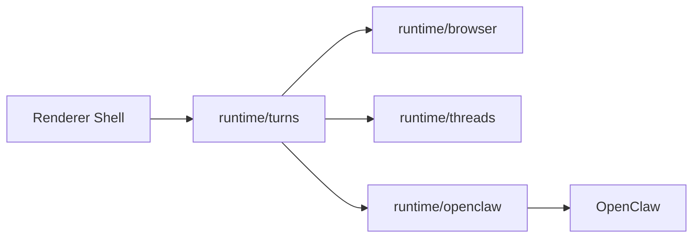
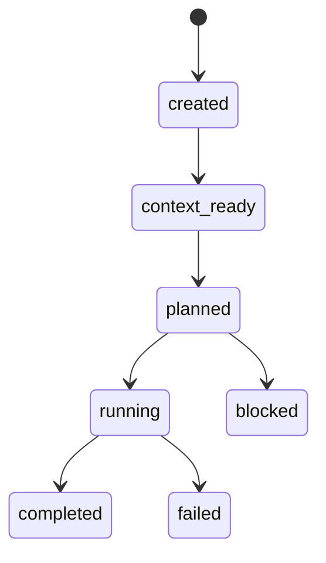

# Sabrina Turn Engine Design

This document is the implementation-facing design for Sabrina's next architecture step.

It does not change Sabrina's product positioning, user-facing features, UI, or interaction model.

It only clarifies how the runtime should organize browser context, thread continuity, and OpenClaw execution into one coherent turn system.

## Why This Exists

Sabrina has already established the right product boundary:

- the browser owns page truth
- threads own user-visible continuity
- OpenClaw owns execution

What is still missing is one stable execution object between them.

Today, Sabrina has:

- a real Browser Context Package
- strong thread continuity
- honest OpenClaw execution rules

But it still lacks one explicit runtime concept for:

- turning user intent into a packaged unit of work
- selecting the correct execution strategy
- normalizing success, failure, and policy rejection
- journaling the result back into thread-visible history

That concept is the **turn**.

## Product Constraint

This design must preserve the current product definition:

- Sabrina remains a browser-native workspace for OpenClaw
- the browser remains first-class when OpenClaw is unavailable
- OpenClaw remains a reused capability plane, not a second platform implemented inside Sabrina

This design must not turn Sabrina into a general-purpose agent runtime.

## Core Proposal

Add one explicit runtime domain:

- `runtime/turns`

The purpose of this domain is simple:

1. accept user intent from the renderer
2. attach browser context and thread continuity
3. choose an execution strategy
4. execute through `runtime/openclaw` or browser-native generation services
5. normalize the result into a durable turn receipt

## Current Implementation Status

Sabrina now has a thin but real `runtime/turns` implementation.

Current implementation:

- `TurnEngine` exists and already owns the first execution boundary for browser AI turns
- `TurnPlanner` exists and selects the initial strategy and policy decision
- `TurnReceiptService` exists and normalizes completed and failed turn receipts
- thread AI turns, OpenClaw background handoff, and GenTab generation now route through this turn layer before appending back into thread history

Current implementation:

- [TurnEngine.mjs](/Users/jiaqi/Documents/Playground/sabrina-ai-browser/runtime/turns/TurnEngine.mjs)
- [TurnPlanner.mjs](/Users/jiaqi/Documents/Playground/sabrina-ai-browser/runtime/turns/TurnPlanner.mjs)
- [TurnReceiptService.mjs](/Users/jiaqi/Documents/Playground/sabrina-ai-browser/runtime/turns/TurnReceiptService.mjs)
- [ThreadTurnService.mjs](/Users/jiaqi/Documents/Playground/sabrina-ai-browser/runtime/threads/ThreadTurnService.mjs)

## Updated Runtime Map



### `runtime/browser`

Owns:

- tab state and navigation
- page extraction
- Browser Context Package construction
- browser-side extraction cache
- browser-native derived artifact inputs

Must not own:

- thread history
- execution routing
- skill success semantics

### `runtime/threads`

Owns:

- thread identity and binding
- durable user-facing history
- turn append semantics
- reference selection continuity

Must not own:

- raw page extraction
- model/gateway policy
- skill compatibility rules

### `runtime/openclaw`

Owns:

- binding and connection state
- gateway routing
- model policy
- skill catalog normalization
- execution and trace semantics
- task recording

Must not own:

- browser page truth
- thread resolution
- renderer-only UI state

### `runtime/turns`

Owns:

- turn intake
- execution planning
- strategy selection
- receipt normalization
- journaling of turn outcomes

Must not own:

- browser scraping
- durable OpenClaw state
- long-term renderer state

## New Runtime Objects

### `TurnIntent`

The renderer should stop dispatching feature-specific ad hoc commands and instead dispatch one of a small set of turn intents.

```ts
type TurnIntent =
  | { type: 'ask'; threadId: string; text: string }
  | { type: 'skill'; threadId: string; skillName: string; text?: string }
  | { type: 'handoff'; threadId: string; text: string }
  | { type: 'gentab'; threadId: string; prompt: string }
```

This is not a product change.
It is an internal execution boundary.

### `BrowserContextPackage`

The Browser Context Package should evolve from a content package into an execution package.

Current package contents are correct but incomplete for long-term execution planning.

It should grow to include a second section of **execution facts**.

```ts
type BrowserContextPackage = {
  primary: BrowserPageSnapshot | null
  references: BrowserPageSnapshot[]
  selection: BrowserSelectionState | null
  requestedReferenceIds: string[]
  missingReferenceIds: string[]
  stats: {
    primaryChars: number
    referenceChars: number
    referenceCount: number
  }
  execution: {
    primarySourceKind:
      | 'public-http'
      | 'private-http'
      | 'local-file'
      | 'internal-surface'
      | 'non-http'
      | 'missing-url'
    reachability: 'reachable' | 'unknown' | 'browser-only'
    authBoundary: 'none' | 'session-auth' | 'private-origin' | 'internal-only'
    trustLevel: 'public' | 'private' | 'local' | 'internal'
    reproducibility: 'replayable' | 'not-guaranteed' | 'browser-only'
    lossinessFlags: string[]
  }
}
```

The important rule is:

- `runtime/browser` owns the facts
- `runtime/turns` uses the facts
- `runtime/openclaw` must not rediscover them from prompts

## Turn Planning

`runtime/turns` should introduce one planner:

- `TurnPlanner`

Its job is to convert:

- `TurnIntent`
- `BrowserContextPackage`
- thread state
- OpenClaw capability data

into a concrete `ExecutionPlan`.

```ts
type ExecutionPlan = {
  turnType: 'ask' | 'skill' | 'handoff' | 'gentab'
  strategy:
    | 'chat_response'
    | 'strict_skill_execution'
    | 'background_task'
    | 'artifact_generation'
  browserContext: {
    primarySourceKind: string
    authBoundary: string
    trustLevel: string
    reproducibility: string
    selectionState: 'page' | 'selection'
    totalSourceCount: number
    executableSourceCount: number
    browserOnlySourceCount: number
    replayableSourceCount: number
    lossinessFlags: string[]
  }
  skillPolicy?: {
    name: string
    mode: 'strict' | 'assist'
    ready: boolean
    missingSummary?: string
    compatibilitySource?: string
    inputMode?: 'page-snapshot' | 'source-url'
    supportedSourceKinds?: Array<'public-url' | 'private-url' | 'local-file'>
  }
  inputPolicy: {
    kind:
      | 'browser-chat'
      | 'browser-skill'
      | 'browser-handoff'
      | 'artifact-generation'
    sourceRoute?: string
    sourceRouteLabel?: string
    canExecute?: boolean
    routeNote?: string
    failureReason?: string
  }
  policyDecision:
    | 'allow'
    | 'reject'
    | 'allow-with-honesty-constraints'
  notes: string[]
}
```

The planner should be the only place that decides:

- whether a skill can run against this source
- whether URL handoff is allowed
- whether a local file handoff is allowed
- whether the turn must fail early

## Turn Engine

`TurnEngine` is now the thin runtime entry point for browser-originated AI work and should continue to absorb the remaining ad hoc turn paths.

Responsibilities:

1. receive `TurnIntent`
2. request a `BrowserContextPackage`
3. load the active thread
4. build an `ExecutionPlan`
5. execute via the appropriate runtime service
6. normalize the result
7. write back to thread/task/artifact stores

This means:

- `ask`
- `strict skill`
- `background handoff`
- `GenTab`

all go through one lifecycle, even if they use different execution strategies.

## Turn State Machine



### State meanings

- `created`: intent accepted, no browser context attached yet
- `context_ready`: browser package attached
- `planned`: execution strategy chosen
- `running`: execution in progress
- `completed`: execution finished with a truthful success result
- `failed`: execution attempted and failed
- `blocked`: policy blocked execution before attempt

This state machine is intentionally small.
It is not trying to become a workflow engine.

## Turn Receipt

Every turn should end in one normalized receipt type.

```ts
type TurnReceipt = {
  status: 'completed' | 'failed' | 'blocked'
  strategy:
    | 'chat_response'
    | 'strict_skill_execution'
    | 'background_task'
    | 'artifact_generation'
  summary: string
  userVisibleMessage: string
  trace: {
    model?: string
    skillName?: string
    toolEvents?: string[]
    taskId?: string
  }
  evidence: {
    executionAttempted: boolean
    routeKind?: string
    sourceKind?: string
    honestyConstraintsApplied?: boolean
  }
}
```

The purpose of the receipt is not analytics.
The purpose is product truth:

- did Sabrina actually execute the thing it claimed to execute
- if not, did it fail honestly

## Skill Compatibility Governance

Sabrina should continue using the local browser registry for now, but only as an overlay.

Long-term truth should become explicit metadata from OpenClaw.

To prevent split-brain drift, compatibility data should carry provenance:

```ts
type SkillCapabilityDescriptor = {
  inputMode: 'page-snapshot' | 'source-url'
  sourceKinds: Array<'public-url' | 'private-url' | 'local-file'>
  source: 'skill-metadata' | 'sabrina-overlay' | 'heuristic'
  useHint: string
  overlay: boolean
}
```

Rule:

- prefer OpenClaw capability metadata when present
- allow Sabrina overlay only when OpenClaw has no explicit browser capability
- surface provenance in diagnostics

## Memory And Continuity

This design does **not** declare a unified Sabrina/OpenClaw memory substrate.

That would be premature.

The current truthful model should remain:

- Sabrina owns thread continuity
- OpenClaw owns session/workspace memory
- turns are the exchange boundary between those systems

What `runtime/turns` adds is not memory unification.
It adds a clean **turn journal** so Sabrina can reason about:

- what was asked
- what execution path was chosen
- what receipt came back

without pretending that thread history and OpenClaw memory are the same thing.

## Renderer Contract

The renderer should stay thin.

It should:

- submit `TurnIntent`
- subscribe to thread/runtime state
- render turn progress and receipts

It should not:

- recompute execution policy
- assemble page packages
- own durable turn history

## Migration Plan

### Phase 1

- add `runtime/turns`
- introduce `TurnIntent`, `ExecutionPlan`, `TurnReceipt`
- route existing ask/skill/handoff/gentab code through `TurnEngine`

### Phase 2

- extend Browser Context Package with execution facts
- move current policy decisions to `TurnPlanner`

### Phase 3

- make skill compatibility provenance explicit
- keep Sabrina registry as overlay only

### Phase 4

- add stronger turn journaling and diagnostics
- expose receipts to host-level smoke and acceptance gates

## What This Design Is Not

It is not:

- a general-purpose workflow runtime
- a second OpenClaw platform
- a replacement for Browser Context Package
- a reason to move browser truth into OpenClaw

It is only the missing middle layer that lets Sabrina stay browser-native while becoming more execution-native.

## Rule Of Thumb

If a new browser-side AI feature is added, the path should be:

1. build or request a Browser Context Package from `runtime/browser`
2. bind it to user continuity through `runtime/threads`
3. execute through `runtime/turns`
4. delegate actual model/skill/task execution to `runtime/openclaw`

If a feature skips the turn layer and talks directly from UI to OpenClaw execution, the boundary is drifting.
